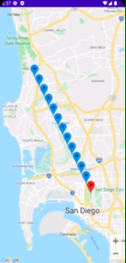

# Location Mocking Example

This repository shows one approach to mocking location using `LiveData`.

**Note: you will need to plug in your own Maps API key in `local.properties` to see things.**

## Example: Mocking Locations Along a Straight Line



## Background

### `LiveData`

[See official documentation here.](https://developer.android.com/topic/libraries/architecture/livedata)

`LiveData<T>` is, more or less, an implementation of the observer pattern 
for a value of type T that is Android-aware and will not explode when a device 
is rotated or an activity is paused and resumed. From the docs:

> LiveData is an observable data holder class. Unlike a regular observable, LiveData is lifecycle-aware, meaning it respects the lifecycle of other app components, such as activities, fragments, or services. This awareness ensures LiveData only updates app component observers that are in an active lifecycle state.

A `LiveData<T>` supports being 

There are a couple implementations of `LiveData<T>` we use here:

  - `MutableLiveData<T>`
    - A piece of live data which we can manually update the value for. 
    - Think of this as an observable box, which we can put values into using `postValue`.
    - Casting up to `LiveData<T>` hides the `postValue` method from observers.
  - `MediatorLiveData<T>`
    - A live data instance which mediates between other live data.
    - A `MediatorLiveData` can have other live data added or removed as sources.
      - It may update its own value when these change.
    - Simplest example is merging two sources of updated.
      - For example: actual location updates and mock location updates.
    - Casting up to `LiveData<T>` hides `addSource`/`removeSource`/etc methods from observers.
    

## This Repository

## `Coord`/`Coords`

A utility class for managing a latitude/longitude pair. It contains:

  - `Coord`
    - Factory method and fields.
      - `Coord.of(32.0, -117.0)`
    - Conversion utilities for `LatLng` (from Maps) and `Location` (from Location).
      - `Coord.fromLatLng`/`Coord.toLatLng`
        - Delete these methods if your project app isn't using Maps to remove the dependency.
      - `Coord.fromLocation`
      - Note: there is no `toLocation` because we would also need elevation, accuracy, etc.
    - Miscellaneous:
      - `toString`
      - `equals`/`hashCode`
  - `Coords`
    - Math utilities for working with `Coord` instance.
      - `Coords.midpoint(p1, p2)`


## `LocationModel`

The `LocationModel` in this codebase is an Android `ViewModel`, like that used 
for working with data from Room. It contains three `LiveData` instances:

  - `locationProviderSource`:
    - A `MutableLiveData` that is updated whenever a location update comes in from the Location Service.
  - `mockSource`
    - A `MutableLiveData` that is updated whenever `mockLocation` is called.
  - `lastKnownCoords`
    - A `MediatorLiveData` that merges events from both of the other two `LiveData`.

### Mocking Support

`LocationModel` contains two examples of how to inject mock locations. One for a single point, and one for a list of points.

```java
    @VisibleForTesting
    public void mockLocation(Coord coords) {
        mockSource.postValue(coords);
    }

    @VisibleForTesting
    public Future<?> mockRoute(List<Coord> route, long delay, TimeUnit unit) {
        return Executors.newSingleThreadExecutor().submit(() -> {
            int i = 1;
            int n = route.size();
            for (var coord : route) {
                // Mock the next location...
                Log.i(TAG, String.format("Model mocking route (%d / %d): %s", i++, n, coord));
                mockLocation(coord);

                // Sleep for a while...
                try {
                    Thread.sleep(unit.toMillis(delay));
                } catch (InterruptedException e) {
                    e.printStackTrace();
                }
            }
        });
    }
```

## `MapsActivity`

**This is example code, NOT starter code. You don't need a map in your project.**

This is pretty much the same code as in Lab 7, but pins are placed on the map for one or both of real GPS updates or mock updates, but 
with an additional extra passed in via intent to control whether real location updates are used:

```java
this.useLocationService = getIntent().getBooleanExtra(EXTRA_USE_LOCATION_SERVICE, false);
```

If the `EXTRA_USE_LOCATION_SERVICE` extra is set to `false`, then only mocked location updates will be shown, and 
location permissions will not be requested. This is appropriate for testing purposes.

You can inject mock locations using the forwarded methods on `MapsActivity`. For example:

```java
@Test
void test() {
  Intent intent = new Intent(MapsActivity.class)
  intent.putExtra(MapsActivity.EXTRA_USE_LOCATION_SERVICE, false);

  scenario.onActivity(activity -> {
      activity.mockLocation(...);
  });
}
```
